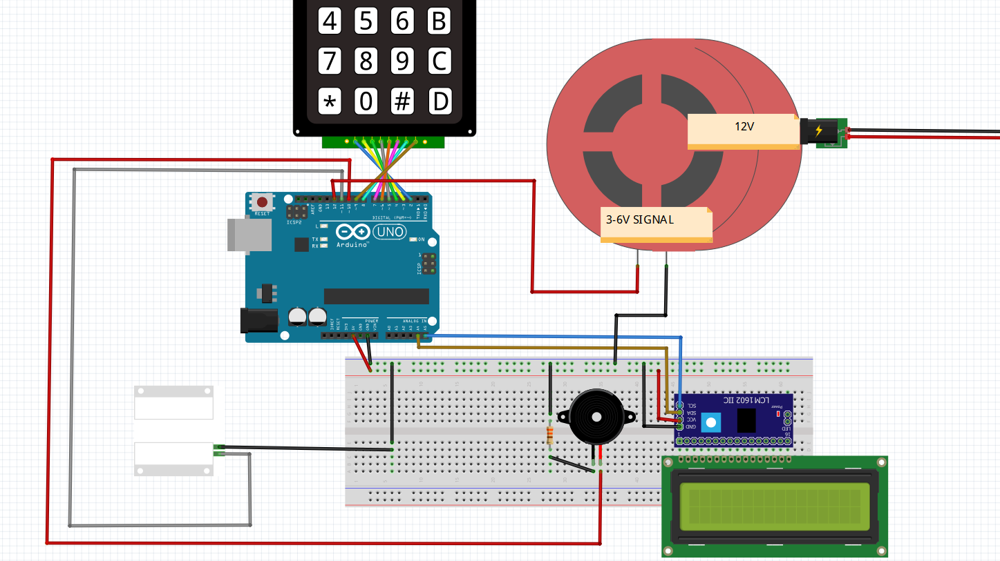

# Home Security System

-ENG- 

With this project I prepared with Arduino, it is possible to ensure the security of your home against theft.

-TR-
 
Arduino ile hazırladığım bu proje ile hırsızlıklara karşı evinizin güvenliğini sağlamanız mümkün.

## Materials Needed

1x Arduino Uno

1x Breadboard

1x Keypad

1x 330 Ohm

1x Buzzer

1x 16x2 LCD 

1x LCM1602 IIC V1

1x built-in amplifier siren with 12v input and separate signal input (Attention! Only those who will use siren working as a 12v signal should use TİP122.)

1x Magnetic door sensor

x Jumpers

## Circuit Diagram

## Details About Usage

-ENG-

After completing the project circuit..

-Before loading the code, do not forget to write your 4-digit password for the "String password" variable in the code content. Otherwise, it is not possible to change the password on the keypad after the project is loaded.

-Installation button is 'A'. All buttons except the A button will return with an error message.

-After pressing the setup button, enter your password and then press the '#' which is the confirmation button. (Ex: A1234#)

-In case of any problem while entering the password, you can delete the entered values ​​with the 'D' button and exit the setup menu.

-If the password is entered correctly in the setup menu, the LCD screen will inform you that the alarm is active.
There are **20seconds** for the alarm to activate after the password is entered. It is recommended to hurry.

-After the alarm is set, the magnetic sensor will continuously check.
During the inspection, if the magnetic sensor is cut (when the door is opened), the password section will be active, and then the **25 seconds** time required to enter your 4-digit password will begin.

-If the password is entered correctly within 25 seconds the alarm system will be disabled, if not, the siren will be active.

-If the alarm sounds due to incorrectly entered passwords, it is recommended that you do not wait for the siren to turn off and enter the password as soon as possible. If the password is not entered, the siren will continue to ring **2 minutes**.

Caution: Those who do not have a generator are recommended to install an additional battery in the circuit against power cuts.

-TR- 

Proje kurulumunu tamamladıktan sonra..

-Kodu yüklemeden önce kod içeriğindeki "String sifre" değişkeninin karşılığına 4 haneli şifrenizi yazmayı unutmayın. Aksi takdirde proje yüklendikten sonra şifre değişimi keypad üzerinden mümkün değildir.

-Kurulum butonu 'A' dır. A butonu dışındaki tüm butonlar hata mesajıyla geri dönüş verecektir.

-Kurulum butonuna bastıktan sonra şifrenizi girin ve ardından onay tuşu olan '#' ye  basın. (Örn: A1234#)

-Şifre girerken herhangi bir aksilik durumunda 'D' butonu ile girilen değerleri silebilir, kurulum menüsünden çıkabilirsiniz.

-Kurulum menüsünde şifre doğru girilirse Lcd ekran alarmın aktif olduğuna dair sizi bilgilendirecektir.
Şifre girildikten sonra alarmın devreye girmesi için **20 saniye** vardır. Acele etmeniz önerilir.

-Alarm kurulduktan sonra manyetik sensör sürekli olarak denetim yapacaktır. 
Denetim esnasında manyetik sensör kopukluğunda (kapı açıldığında) şifre bölümü aktif olacak ve ardından 4 haneli şifrenizi girmeniz için gerekli süre olan **25 saniyelik** süre başlayacaktır.

-25 saniye içerisinde şifre doğru girilirse alarm sistemi deaktif, girilmez ise siren aktif olacaktır.

-Yanlış girilen şifreler yüzünden alarm çalarsa sirenin kapanmasını beklememeniz, şifreyi en kısa sürede girmeniz önerilir. Şifre girilmediği takdirde siren **2 dakika** boyunca çalmaya devam edecektir.

Dikkat: Evinde jeneratör olmayanların elektrik kesintilerine karşı devreye ilave akü takması önerilir.